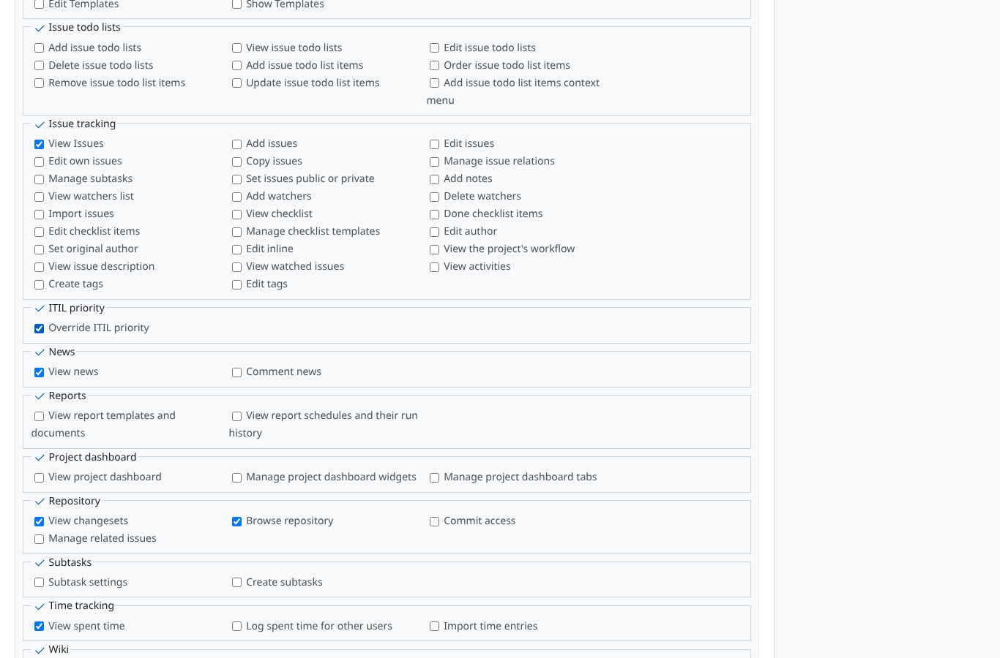
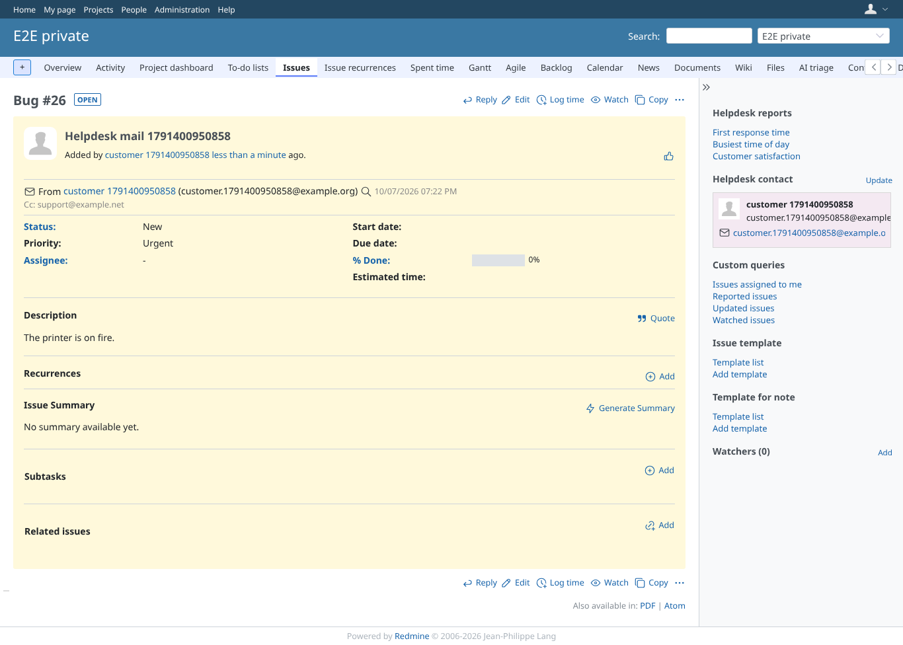
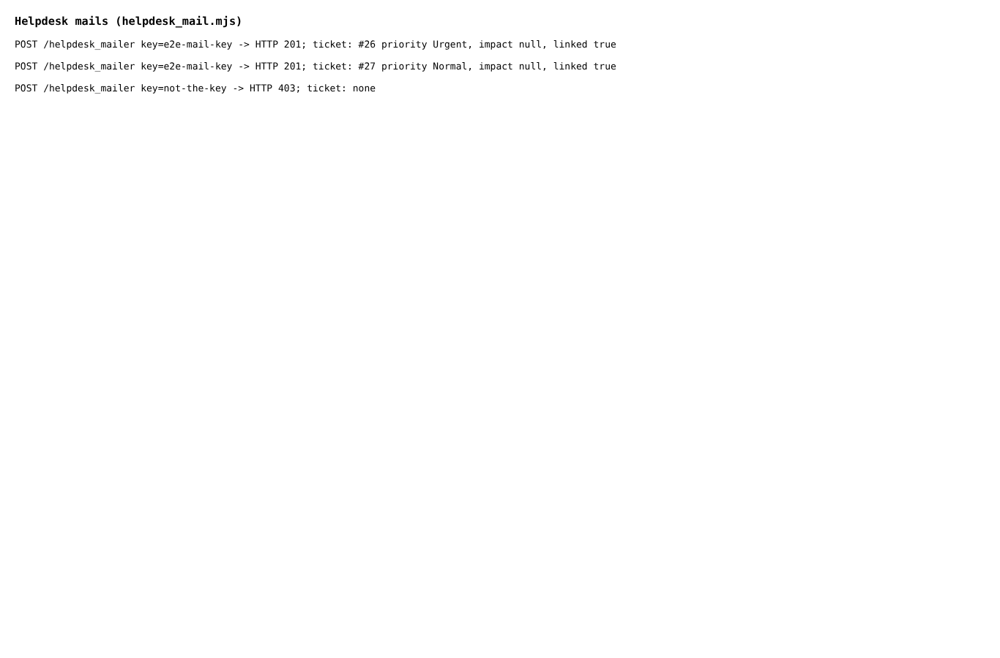

# helpdesk_mail

Run 2026-10-07T19:23:30.544Z against http://127.0.0.1:3003.

| screenshot | user | URL | shows |
|---|---|---|---|
|  | admin | `/roles/2/edit` | Administration > Roles > Anonymous: "Override ITIL priority" ticked, the account helpdesk mail is processed as |
|  | admin | `/issues/26` | Helpdesk ticket from mail on the private project keeps the helpdesk priority Urgent |
|  | admin | `/issues/27` | Without the right the ticket gets the default priority Normal |
|  | admin | `/my/page` | The three helpdesk mails and their outcome: Urgent with the right, Normal without, 403 for a wrong key |
