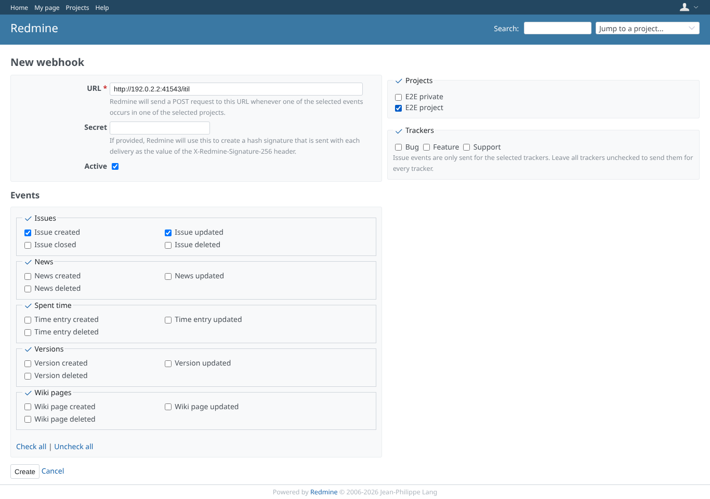
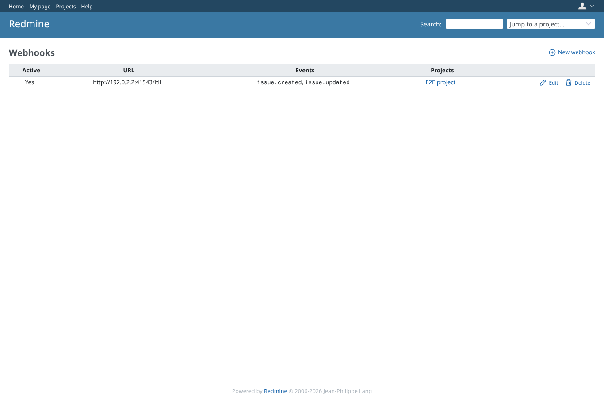
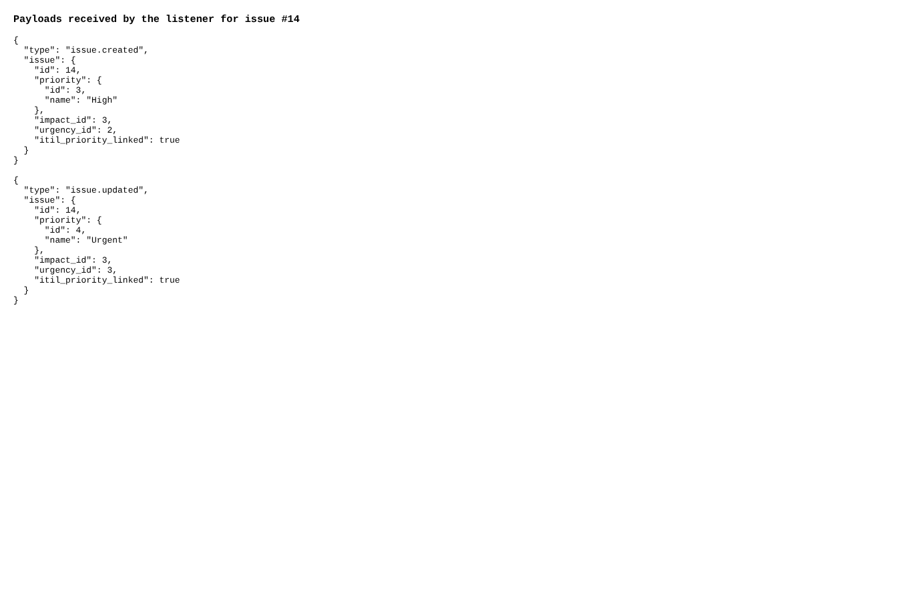

# webhook

Run 2026-10-07T16:30:50.904Z against http://127.0.0.1:3003.

| screenshot | user | URL | shows |
|---|---|---|---|
|  | manager | `/webhooks/new` | Manager creates a webhook for issue created/updated in E2E project, to a local listener |
|  | manager | `/webhooks` | After the sudo password the webhook is created and listed |
|  | manager | `/issues/14` | The webhook payloads (created, updated) carry impact_id, urgency_id and itil_priority_linked |
