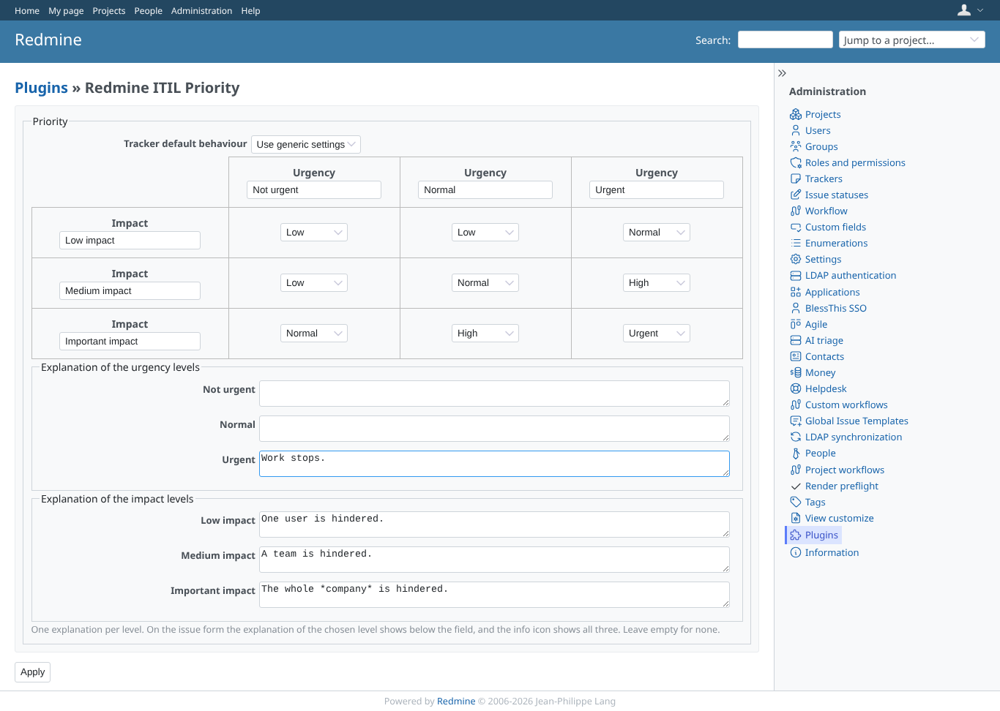
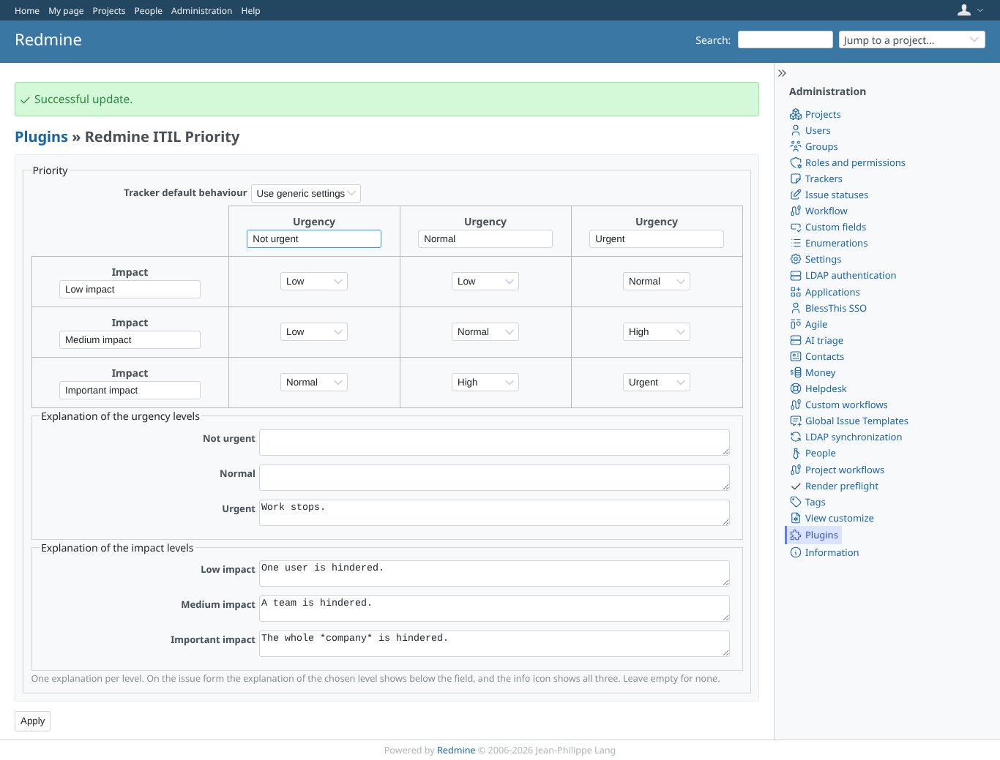
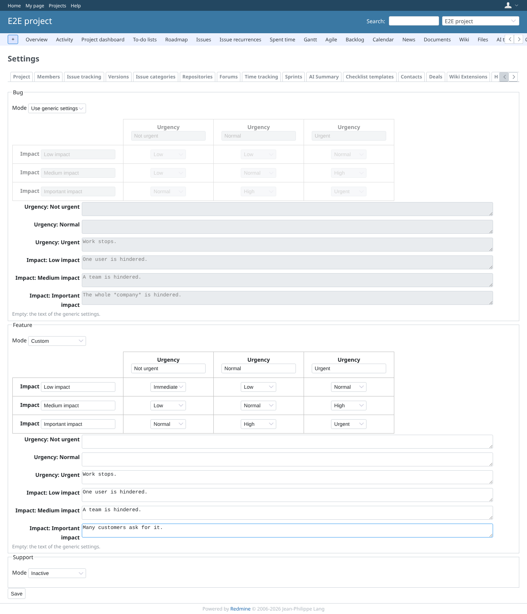
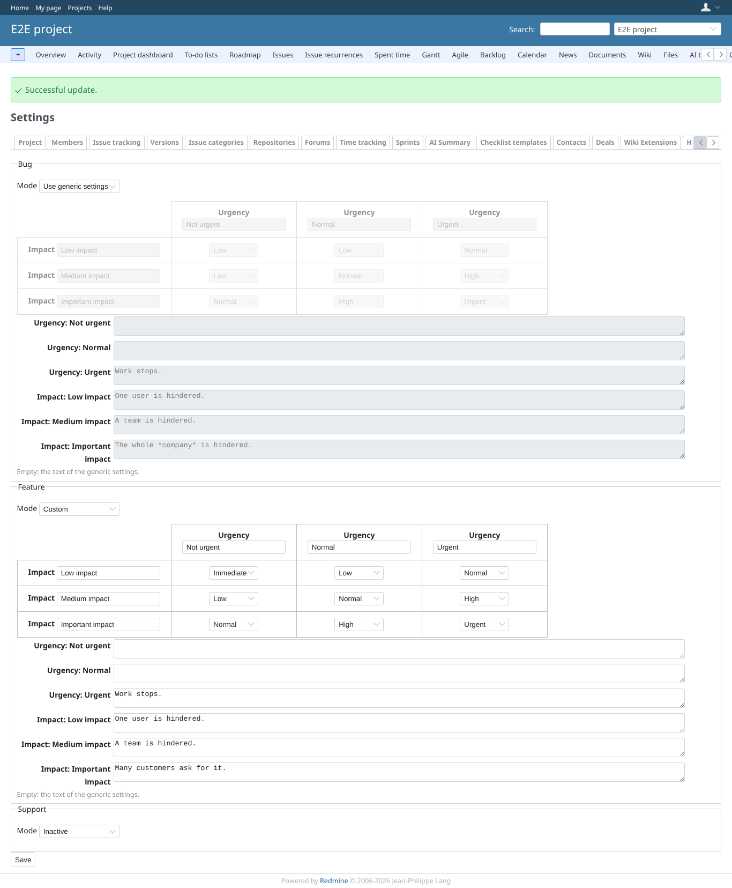
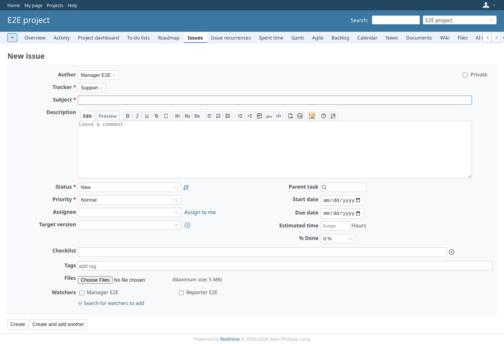
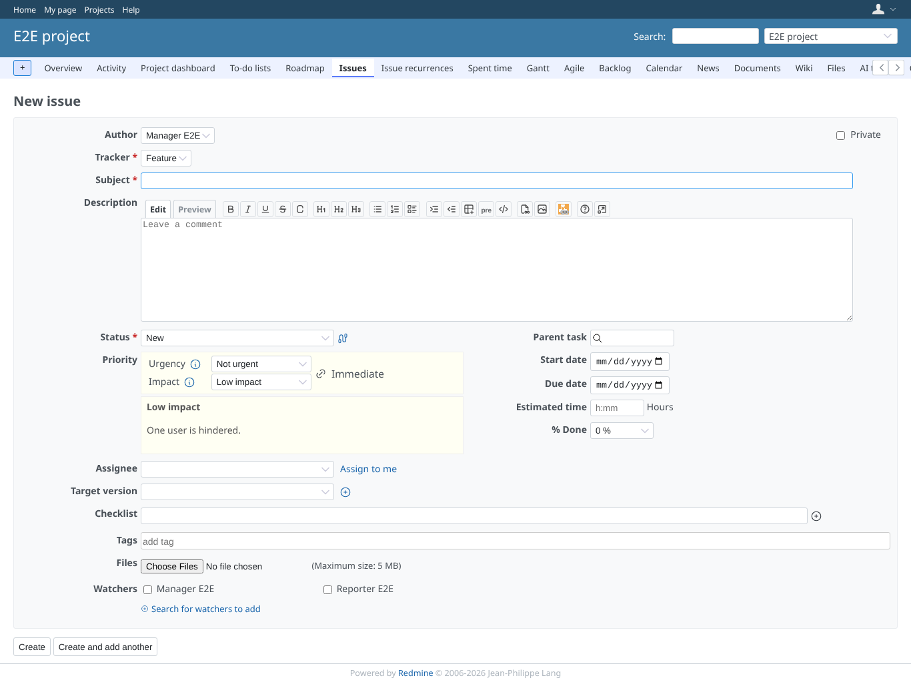

# settings

Run 2026-10-07T16:42:45.400Z against http://127.0.0.1:3003.

| screenshot | user | URL | shows |
|---|---|---|---|
|  | admin | `/settings/plugin/redmine_itil_priority` | Administration > Plugins > ITIL priority: default tracker mode, labels, matrix and an explanation per level of urgency and impact |
|  | admin | `/settings/plugin/redmine_itil_priority` | Saved: the urgency help text is stored |
|  | manager | `/projects/e2e-project/settings/itil_priority` | Project settings, tab ITIL priority: Bug generic (greyed), Feature custom (editable, own explanation per level), Support inactive (hidden) |
|  | manager | `/projects/e2e-project/settings/itil_priority` | Saved, with the success notice; the modes are kept |
|  | manager | `/projects/e2e-project/issues/new?issue[tracker_id]=3` | Support is inactive: the issue form has core's plain Priority field |
|  | manager | `/projects/e2e-project/issues/new?issue[tracker_id]=2` | Feature uses its custom matrix (Low x Not urgent = Immediate); the explanations per level were checked for Important impact (own text) and Urgent (generic text) |
|  | reporter | `/projects/e2e-project/settings/itil_priority` | A member without "manage ITIL priority settings" is refused the project settings |
