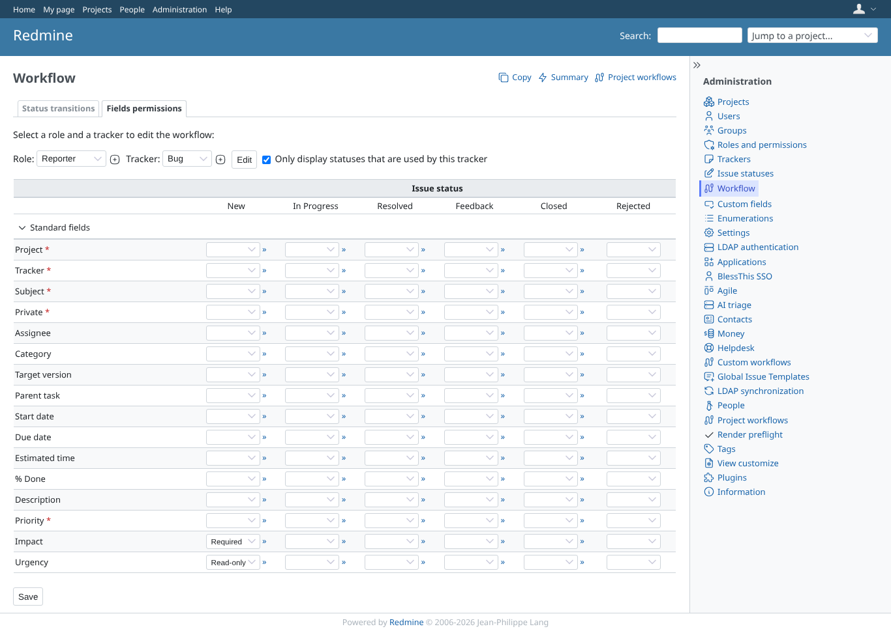
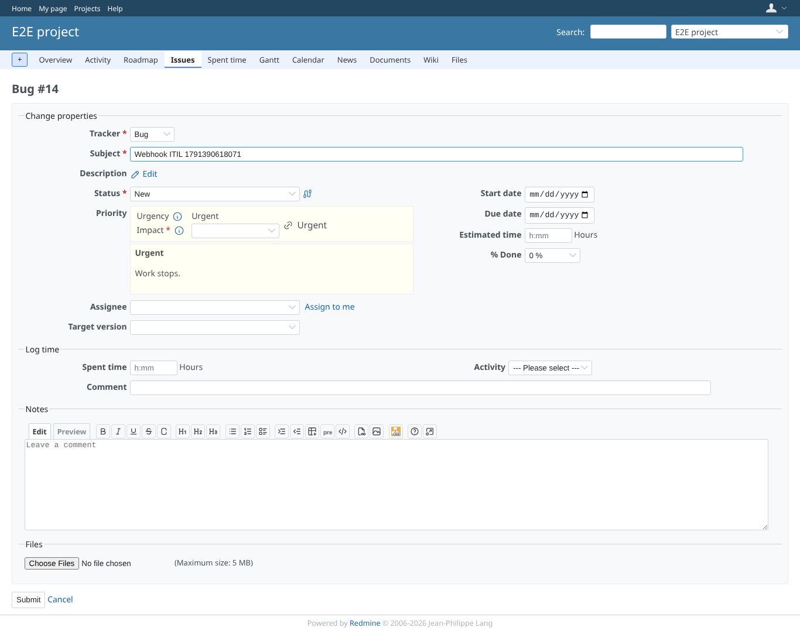
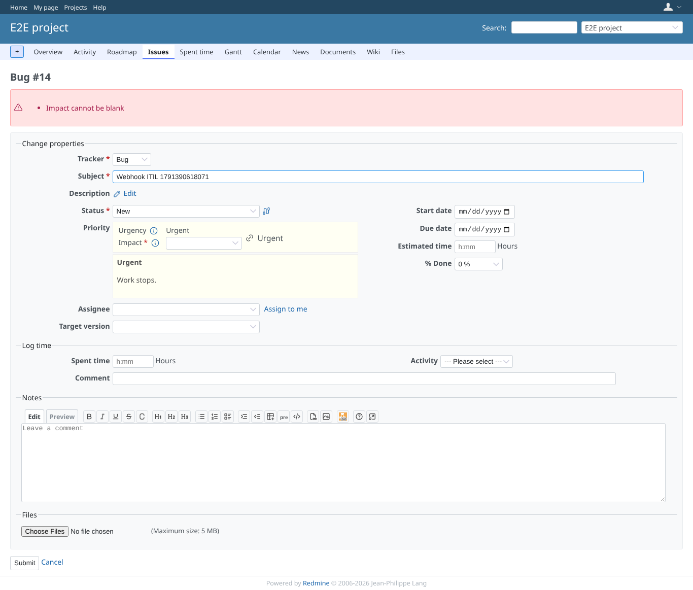
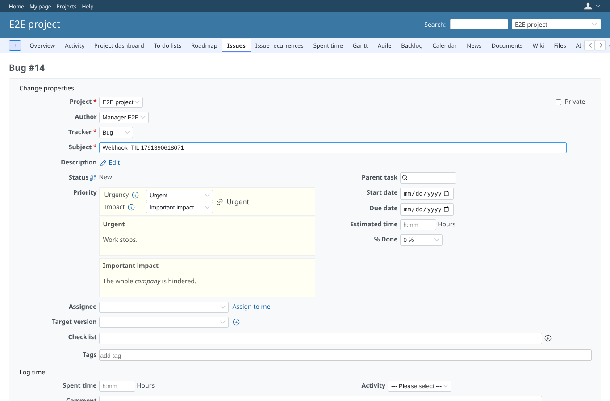

# workflow

Run 2026-10-07T16:32:12.535Z against http://127.0.0.1:3003.

| screenshot | user | URL | shows |
|---|---|---|---|
|  | admin | `/workflows/permissions?role_id=5&tracker_id=1` | Administration > Workflow > Fields permissions: Impact and Urgency listed with the core fields; for Reporter/Bug/New urgency read-only, impact required |
|  | reporter | `/issues/14/edit` | Reporter on a new Bug: urgency read-only (text), impact required (red star), emptied |
|  | reporter | `/issues/14` | Saving without impact is refused: "Impact cannot be blank" |
|  | manager | `/issues/14/edit` | The manager's role has no rules: both fields editable |
