# issue_form

Run 2026-10-07T19:25:07.564Z against http://127.0.0.1:3000.

| screenshot | user | URL | shows |
|---|---|---|---|
| 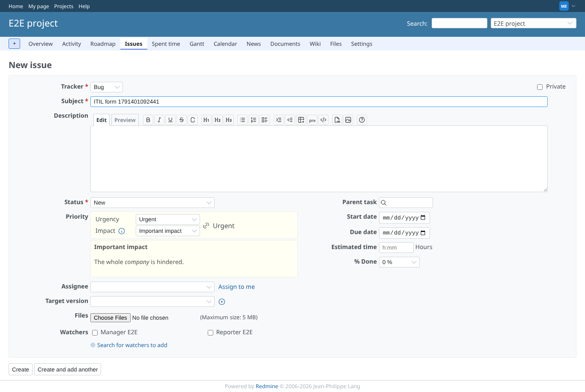 | manager | `/projects/e2e-project/issues/new` | Operator, new issue: Important impact x Urgent gives priority Urgent, calculated live; the link icon shows the priority is linked |
| 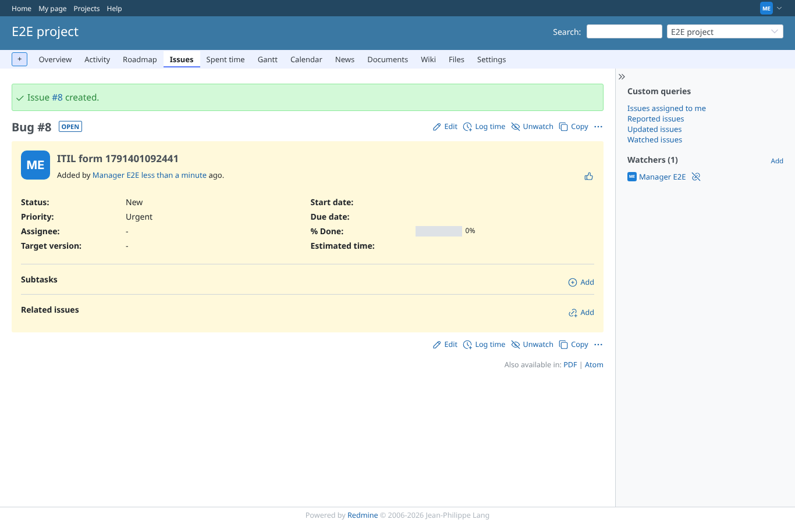 | manager | `/issues/8` | The created issue has priority Urgent |
| 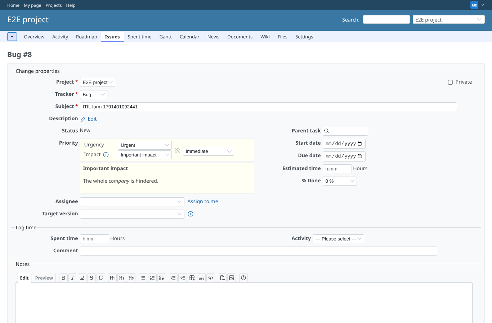 | manager | `/issues/8/edit` | Operator clicks the link icon: it breaks, and the priority can be chosen by hand (Immediate) |
| 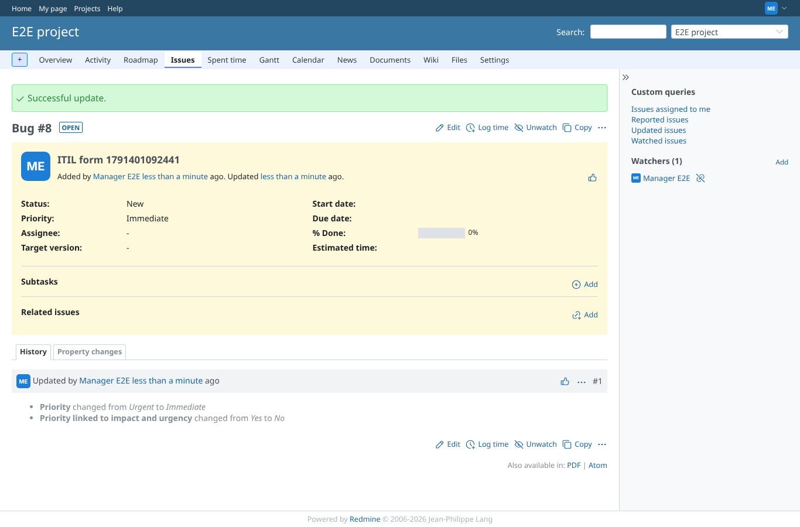 | manager | `/issues/8` | Saved: priority Immediate; the history says "Priority linked to impact and urgency changed from Yes to No" |
| 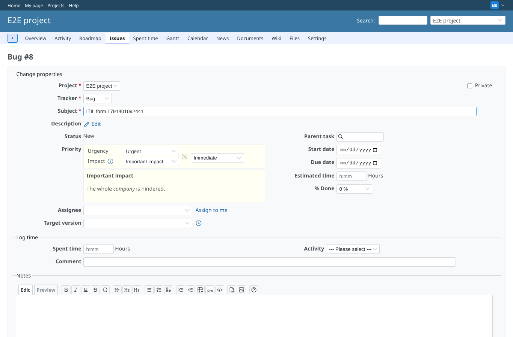 | manager | `/issues/8/edit` | Opening the form again keeps the issue unlinked (before this change it was relinked and recalculated) |
| 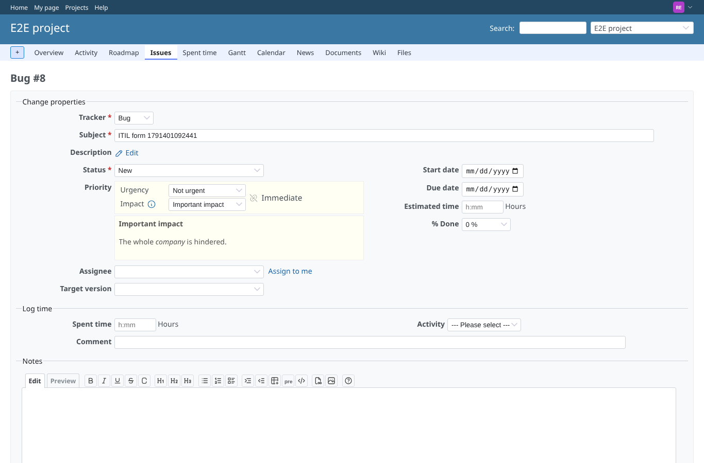 | reporter | `/issues/8/edit` | Helpdesk user (no "override ITIL priority"): impact and urgency editable, priority Immediate shown but not editable, broken link "set by hand" |
| 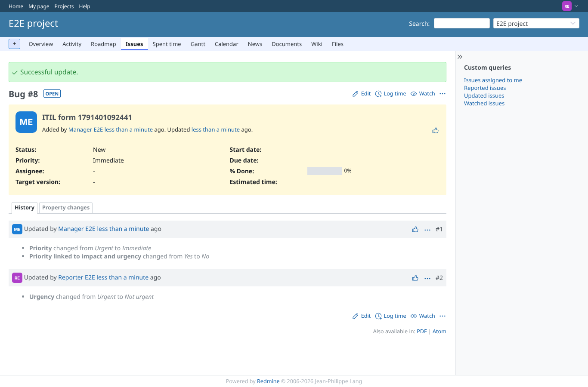 | reporter | `/issues/8` | After the helpdesk user changed the urgency the operator's priority Immediate stays |
| 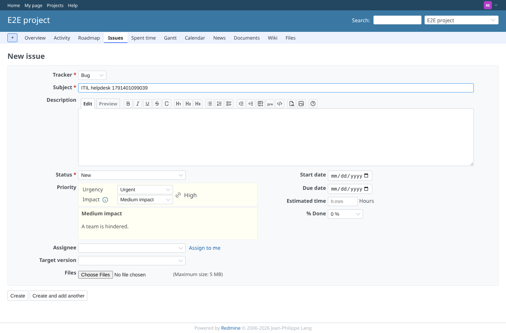 | reporter | `/projects/e2e-project/issues/new` | Helpdesk user, new issue: the ITIL field takes the priority's place after Status; Medium x Urgent gives High |
| 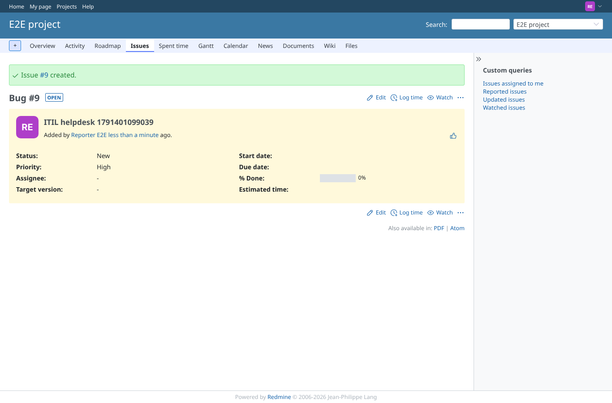 | reporter | `/issues/9` | Created by the helpdesk user with priority High from the matrix |
| 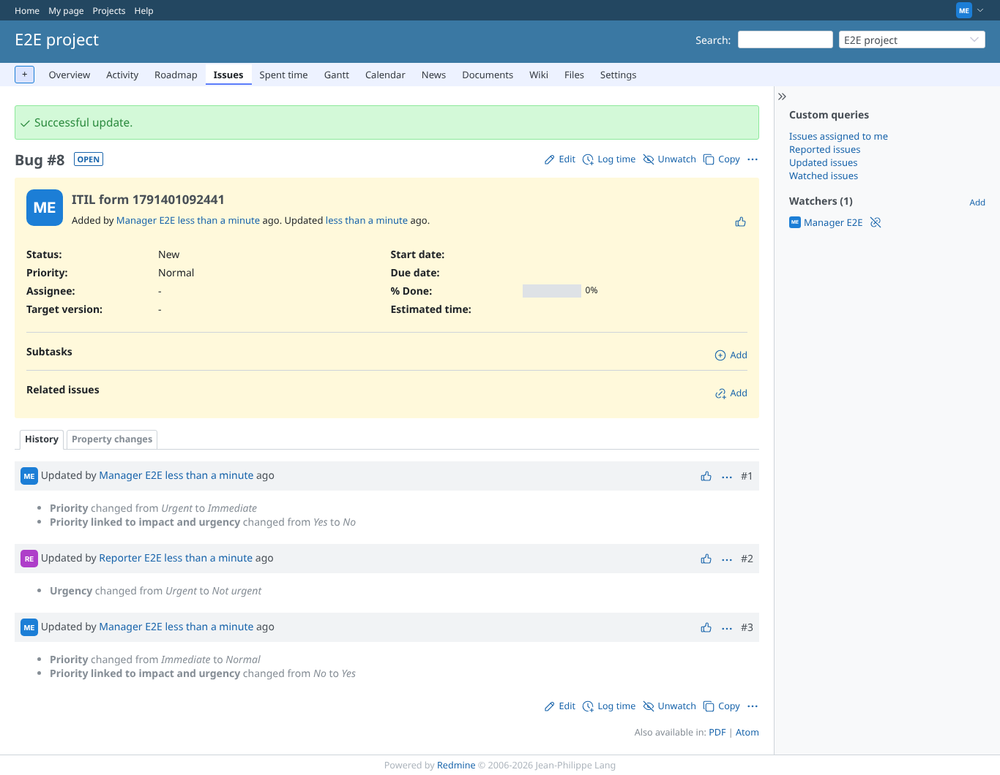 | manager | `/issues/8` | Operator links again: the priority is recalculated (Important x Not urgent = Normal) |
| 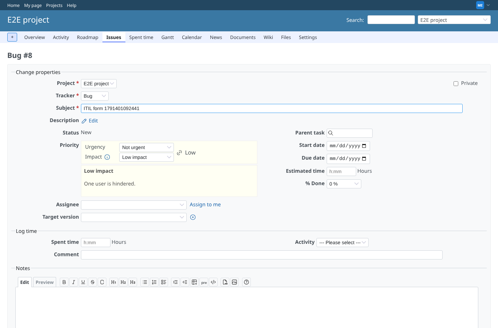 | manager | `/issues/8/edit` | Explanation of the chosen impact level under the field; it follows the selection (Low impact: one user) |
| 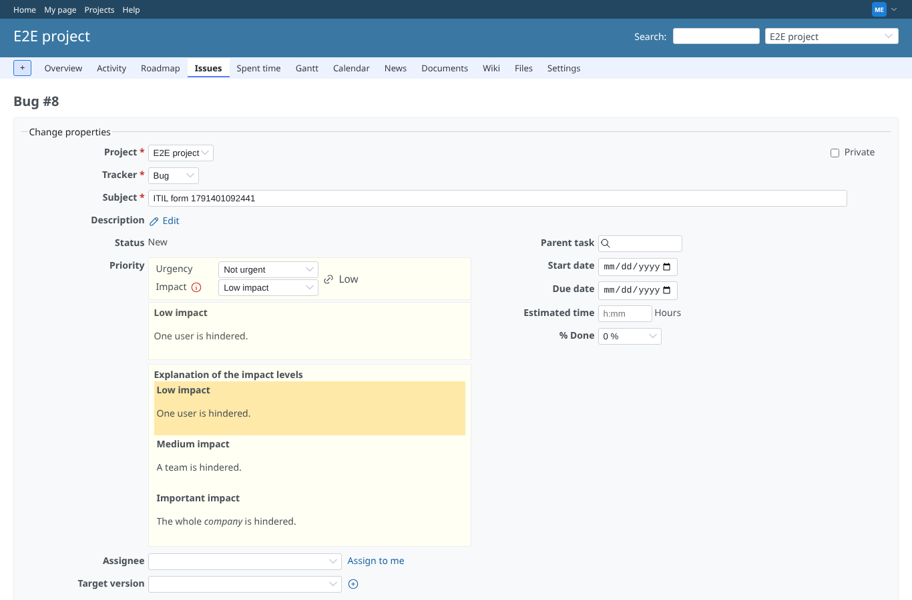 | manager | `/issues/8/edit` | Info icon next to Impact (none next to Urgency, it has no text): all three levels with their explanation, the chosen one marked |
| 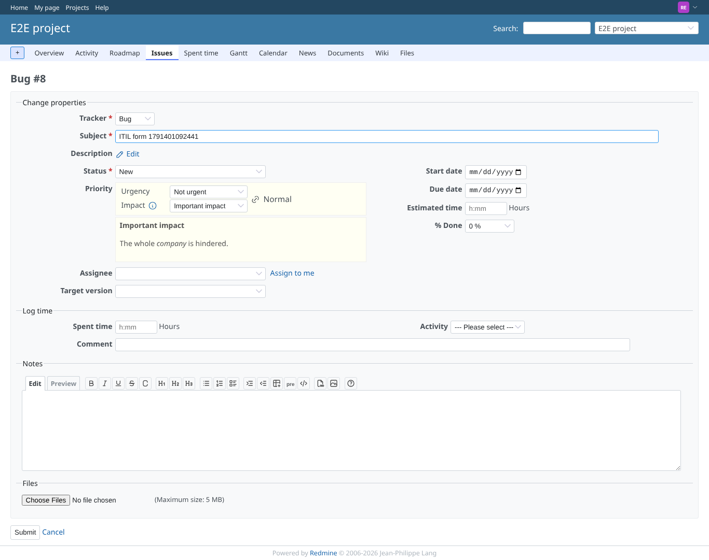 | reporter | `/issues/8/edit` | A helpdesk user sees the same explanation for the impact level |
|  | outsider | `/projects/e2e-private/issues/new` | A non-member cannot open the issue form of the private project |
