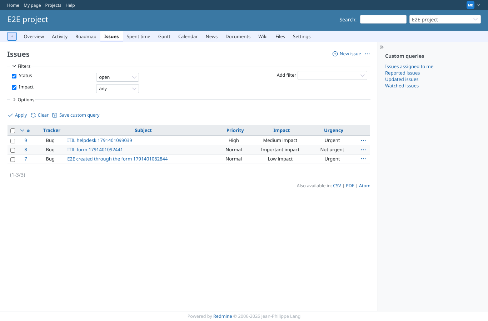
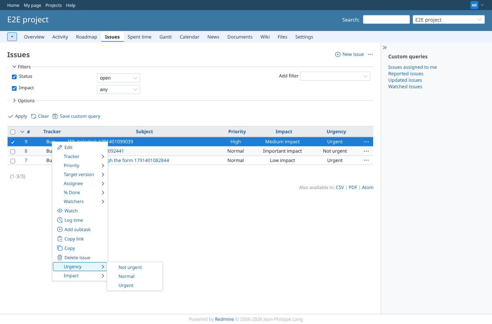
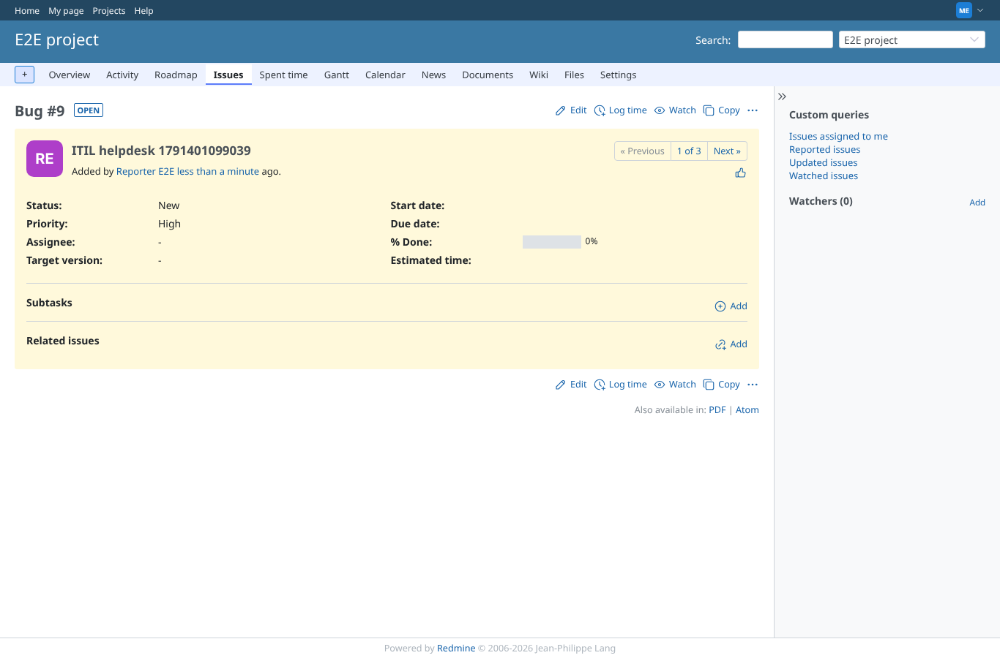
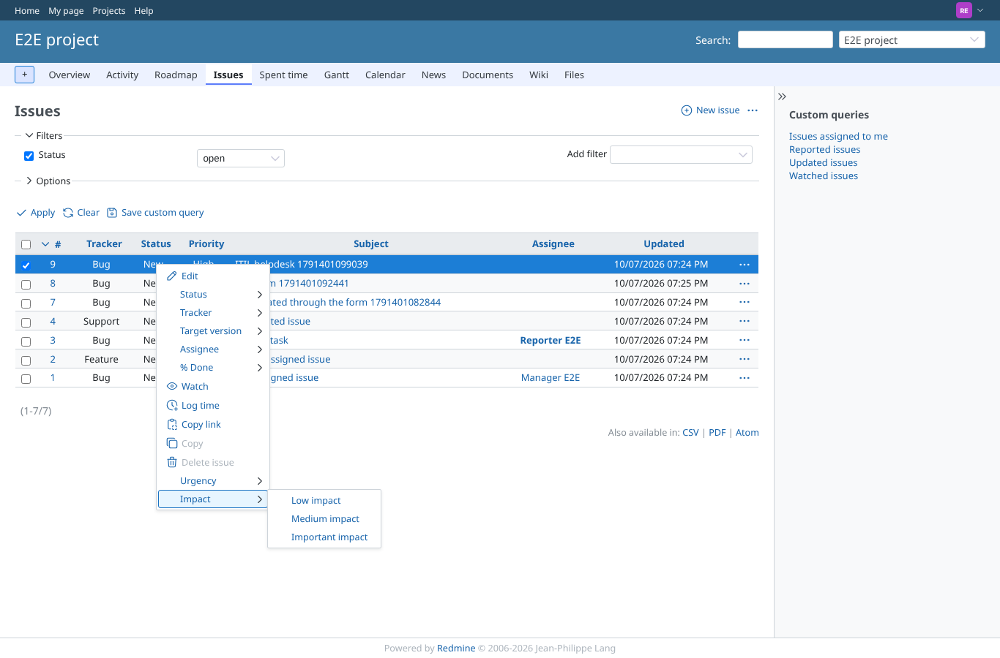
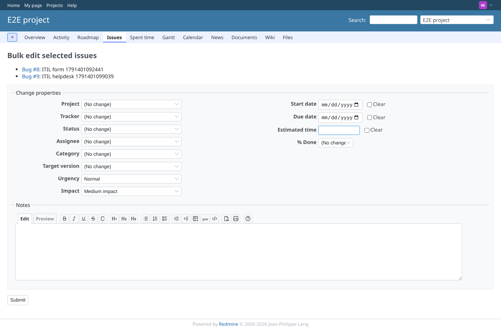
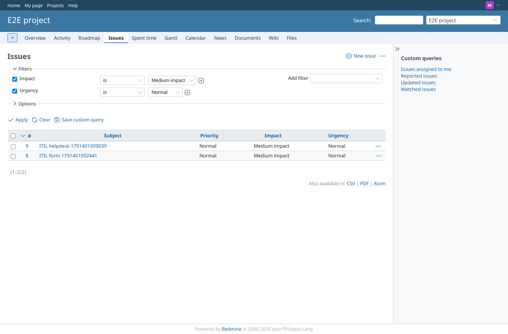

# issue_list

Run 2026-10-07T19:25:16.547Z against http://127.0.0.1:3000.

| screenshot | user | URL | shows |
|---|---|---|---|
|  | manager | `/projects/e2e-project/issues?set_filter=1&f[]=status_id&op[status_id]=o&f[]=impact_id&op[impact_id]=*&c[]=tracker&c[]=subject&c[]=priority&c[]=impact_id&c[]=urgency_id&sort=id:desc` | Issue list with the Impact and Urgency columns (labels, not numbers) and the filter "Impact: any" |
|  | manager | `/projects/e2e-project/issues?set_filter=1&f[]=status_id&op[status_id]=o&f[]=impact_id&op[impact_id]=*&c[]=tracker&c[]=subject&c[]=priority&c[]=impact_id&c[]=urgency_id&sort=id:desc` | Operator: the context menu has Priority, and Urgency/Impact with their labels and the submenu arrow |
|  | manager | `/issues/9` | Urgency set through the context menu; history shows the change with its label |
|  | reporter | `/projects/e2e-project/issues` | Helpdesk user: no Priority in the context menu, Urgency and Impact are there |
|  | reporter | `/issues/bulk_edit?ids%5B%5D=8&ids%5B%5D=9` | Bulk edit as helpdesk user: Urgency and Impact, no Priority |
|  | reporter | `/projects/e2e-project/issues?set_filter=1&f[]=impact_id&op[impact_id]==&v[impact_id][]=2&f[]=urgency_id&op[urgency_id]==&v[urgency_id][]=2&c[]=subject&c[]=priority&c[]=impact_id&c[]=urgency_id` | After the bulk edit, filtered on Impact = Medium and Urgency = Normal: the issues have priority Normal from the matrix |
