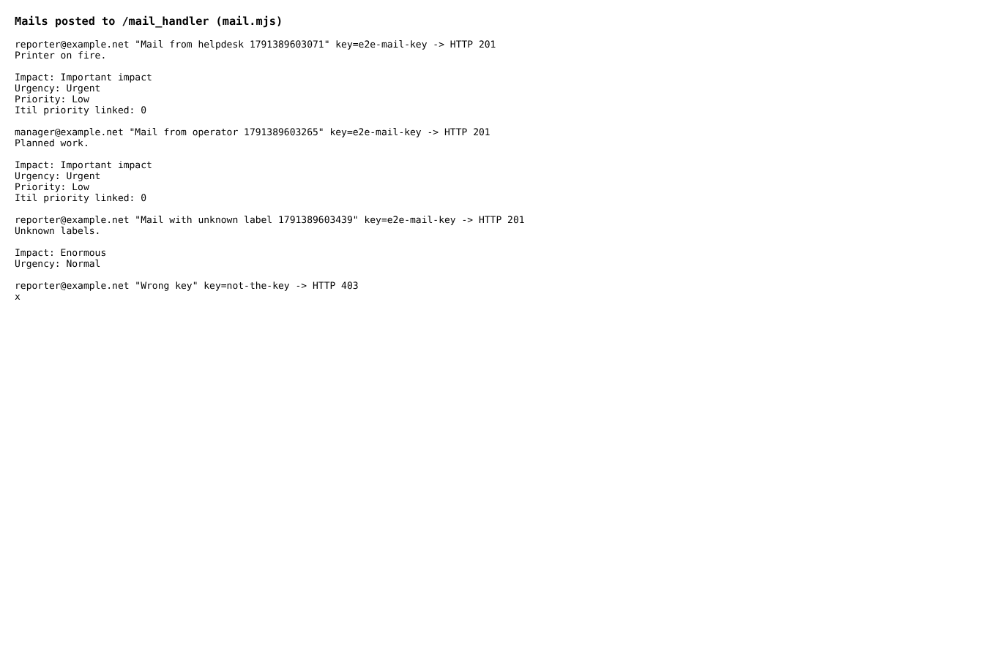
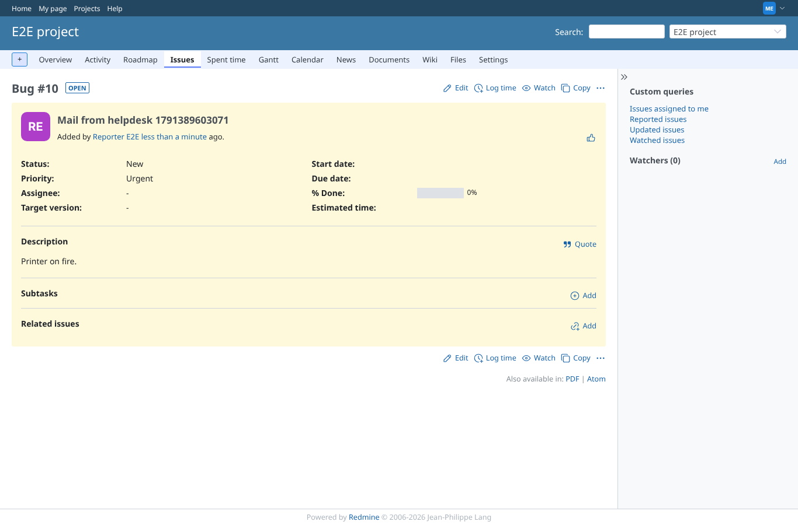
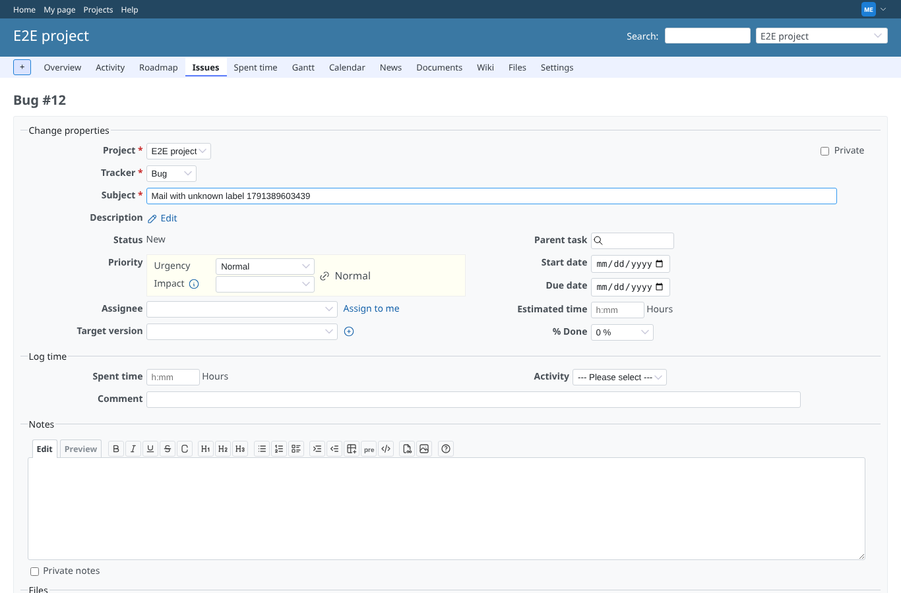

# mail

Run 2026-10-07T16:13:27.791Z against http://127.0.0.1:3000.

| screenshot | user | URL | shows |
|---|---|---|---|
|  | manager | `/my/page` | The four mails with their keywords and the HTTP answers (201 created, 403 for a wrong key) |
|  | manager | `/issues/10` | Helpdesk mail: Priority: Low and "Itil priority linked: 0" ignored, the matrix gives Urgent |
|  | manager | `/issues/11/edit` | Operator mail: priority Low by hand, unlinked (broken link, priority select visible) |
|  | manager | `/issues/12/edit` | Unknown impact label: impact stays empty, the known urgency is set |
