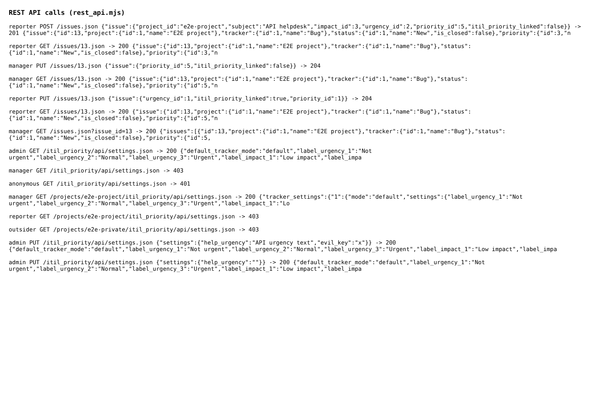
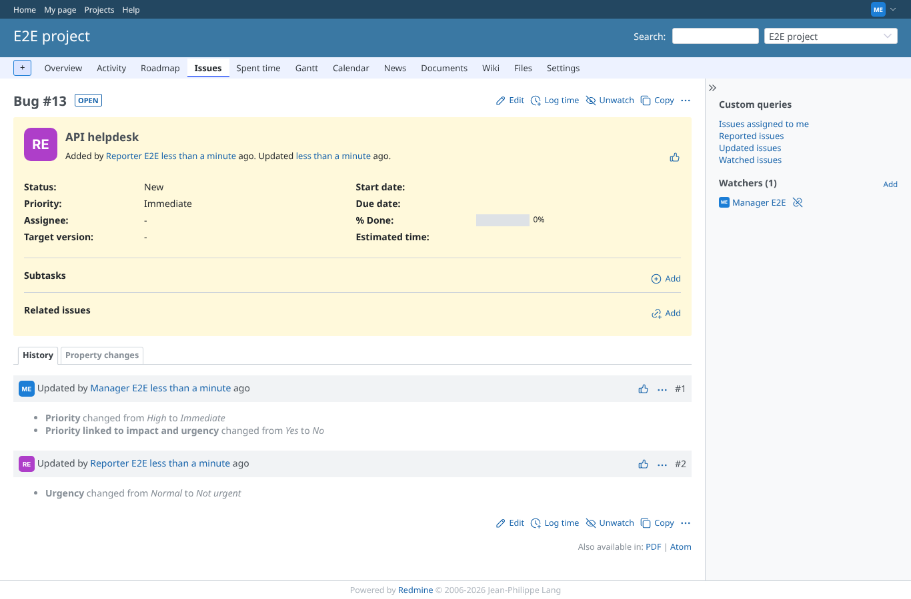

# rest_api

Run 2026-10-07T19:25:41.056Z against http://127.0.0.1:3000.

| screenshot | user | URL | shows |
|---|---|---|---|
|  | manager | `/my/page` | Every REST call of this scenario with its HTTP status and the start of the answer |
|  | manager | `/issues/13` | The issue changed through the API: priority Immediate kept after the helpdesk user changed the urgency and tried to relink |
